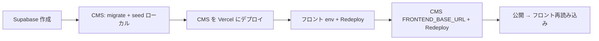

# Vercel + Supabase デプロイ手順

**最終更新:** 2026-05-29  
**対象:** CMS（Next.js + Prisma）と案件フロント（静的 HTML + CSR）を本番接続する

---

## 概要

| コンポーネント | リポジトリ | ホスティング | 状態（作業時点の例） |
|----------------|------------|--------------|----------------------|
| CMS | ヘッドレス CMS 本体 | Vercel（要インポート） | ローカル PG のみ |
| DB | Supabase PostgreSQL | Supabase | ユーザーが作成 |
| 公開サイト | 案件フロント | Vercel | デプロイ済み・**env 未設定の可能性** |

ダッシュボード例: [Vercel チーム](https://vercel.com/5alvia0fficinali50-gmailcoms-projects)

フロント URL 例: `https://0529headless-front.vercel.app`

---

## エージェントがリポジトリに入れたもの

| 項目 | 内容 |
|------|------|
| CMS `package.json` | `postinstall`: `prisma generate`（Vercel ビルドで Client 生成） |
| CMS `vercel.json` | Next.js プリセット・`npm run build`（`next build --webpack`） |
| CMS `.env.example` | Vercel 本番用コメントブロック |
| 本ドキュメント | 手順・環境変数表 |
| `scripts/vercel-env-checklist.md` | コピペ用チェックリスト |

**エージェントが行わないこと:** Supabase 作成、秘密の貼り付け、Git push、Vercel Import、本番 DB への migrate/seed、ダッシュボードでの env 設定（CLI で本番 CMS URL が未定のため）。

**確認済み:** Vercel CLI はログイン済み（`vercel whoami`）。フロントは `.vercel/project.json` あり。**フロントの Environment Variables は 0 件**（`vercel env ls`）→ 本番が `localhost:3000` になる原因。

---

## 推奨の実施順序



1. Supabase で DB を用意する  
2. **ローカル**から Direct 接続で `migrate deploy` と seed  
3. CMS を Vercel に Import・env 設定・デプロイ  
4. フロントの Vercel env を設定して **Redeploy**  
5. CMS に `FRONTEND_BASE_URL` を入れて **Redeploy**  
6. 動作確認  

---

## A. Supabase（ユーザー作業）

1. [Supabase](https://supabase.com/) で新規プロジェクトを作成  
2. **Settings → Database** で接続文字列を取得  
   - **Direct（ポート 5432）** — `npx prisma migrate deploy` / `npx tsx prisma/seed.ts` 用  
   - **Pooler（ポート 6543, `pgbouncer=true`）** — Vercel 上の CMS **runtime** 用  
3. パスワード・URL はリポジトリにコミットしない  

詳細は [delivery-guide.md §8.3](delivery-guide.md#83-supabase-接続) を参照。

---

## B. CMS — ローカル DB 準備（ユーザー作業）

CMS リポジトリで、**一時的に** Direct URL を `.env.local` に設定:

```bash
npm install
# .env.local に DATABASE_URL=<Supabase Direct 5432 URL>
npx prisma migrate deploy
# 本番用パスワードを ADMIN_DEMO_PASSWORD に設定してから:
npx tsx prisma/seed.ts
```

### seed 後にフロントへ渡す値

| 用途 | 値の取り方 | 例（開発フォールバック利用時） |
|------|------------|--------------------------------|
| `SITE_ID` | slug で可 | `main-site` |
| `PUBLIC_API_KEY` | `CMS_PUBLIC_API_KEY` 未設定時はコード上の開発キー | `public-dev-key` |
| `CONTENT_ID` | 管理画面の topPage URL、または Prisma Studio | **seed のたびに UUID が変わる** — 固定例は使わず DB から取得 |
| `CMS_API_BASE_URL` | CMS デプロイ後の origin | `https://<cms-project>.vercel.app` |

本番では `CMS_PUBLIC_API_KEY` を Vercel に設定し、seed またはサイト作成時に発行された平文キーを `PUBLIC_API_KEY`（フロント）に設定すること（`public-dev-key` は本番非推奨）。

`.env.local` の `DATABASE_URL` を **Pooler URL** に戻してから CMS を Vercel に載せる。

---

## C. CMS — Vercel プロジェクト（ユーザー作業）

1. CMS リポジトリを GitHub 等に **push**（未 push ならエージェントは Import 不可）  
2. Vercel → **Add New → Project** → リポジトリを Import  
3. Framework: **Next.js**（`vercel.json` / 自動検出）  
4. **Environment Variables**（Production 推奨。Preview も同値が無難）:

| 変数名 | 必須 | 例 / 備考 |
|--------|------|-----------|
| `DATABASE_URL` | はい | Supabase **Pooler**（6543） |
| `APP_URL` | はい | `https://<cms>.vercel.app`（デプロイ後に確定した URL） |
| `NODE_ENV` | 自動 | Vercel が `production` |
| `CMS_AUTH_PROVIDER` | 本番はい | `authjs` |
| `CMS_ENFORCE_ADMIN_LOGIN` | 本番はい | `true` |
| `AUTH_SECRET` | はい | 長いランダム文字列 |
| `PREVIEW_TOKEN_SECRET` | はい | 長いランダム文字列 |
| `ADMIN_DEMO_EMAIL` | 任意 | `admin@example.com` |
| `ADMIN_DEMO_PASSWORD` | はい | seed 時と同じ強固なパスワード |
| `CMS_PUBLIC_API_KEY` | 本番推奨 | 未設定時のみ `public-dev-key` フォールバック |
| `CMS_ADMIN_API_KEY` | 推奨 | 管理 API 用 |
| `STORAGE_PROVIDER` | はい | `local`（MVP。Vercel 上のアップロードは永続化されない点に注意） |
| `FRONTEND_BASE_URL` | フロント接続時 | 初回デプロイ後に `https://0529headless-front.vercel.app` を追加して **Redeploy** |

5. **Deploy**  
6. デプロイ URL を `APP_URL` に合わせて更新し、再度 **Redeploy**（初回 URL 確定後）  

**ビルド:** `postinstall` で `prisma generate` → `npm run build`（`next build --webpack`）。migrate はビルドに含めない。

---

## D. フロント — Vercel 環境変数（ユーザー作業）

プロジェクト例: `0529headless-front`（既存デプロイあり）

**Settings → Environment Variables**（Production + Preview）:

| 変数名 | 例（CMS 未デプロイ時はプレースホルダ） |
|--------|----------------------------------------|
| `CMS_API_BASE_URL` | `https://<your-cms>.vercel.app` |
| `SITE_ID` | `main-site` または seed 後の site UUID |
| `PUBLIC_API_KEY` | `public-dev-key`（本番は CMS で発行したキーに差し替え） |
| `CONTENT_TYPE` | `topPage` |
| `CONTENT_ID` | seed 後の topPage UUID（DB から取得） |

設定後 **Deployments → Redeploy**（ビルド時に `npm run config` が `js/runtime-config.js` を生成）。

### CLI で設定する場合（任意）

```bash
cd <front-repo>
npx vercel env add CMS_API_BASE_URL production
# 対話で値を入力。他の変数も同様
npx vercel --prod
```

---

## E. 動作確認（ユーザー作業）

1. CMS 管理画面にログイン（`/login`）  
2. トップページを編集して **公開**  
3. `https://0529headless-front.vercel.app` を再読み込み  
4. 変更が反映されれば OK（CSR のためフロントの再デプロイは不要）  

失敗時:

- ブラウザ開発者ツールの CORS / 401 → `FRONTEND_BASE_URL`・`PUBLIC_API_KEY`・`CMS_API_BASE_URL` を確認  
- 404 / 空データ → `CONTENT_ID` が seed 後の ID と一致しているか確認  

---

## 制限・注意

| 項目 | 内容 |
|------|------|
| migrate / seed | Vercel ビルドでは実行しない。必ずローカル（Direct URL） |
| 再 seed | 本番データがある環境では実行しない（ID・API キーが変わる） |
| `STORAGE_PROVIDER=local` | サーバーレスではアップロードファイルが永続化されない |
| 単一 CORS origin | `FRONTEND_BASE_URL` は 1 origin。ローカルと本番を同時に使う場合は切り替えまたは CMS 拡張が必要 |
| 公開 API キー | フロントはビルド時に JS へ埋め込み。本番はキーローテーションとリスク許容を理解すること |

---

## 関連

| ファイル | 内容 |
|---------|------|
| [delivery-guide.md](delivery-guide.md) | 納品・API・§8 運用 |
| [.env.example](../.env.example) | CMS 環境変数 |
| [scripts/vercel-env-checklist.md](../scripts/vercel-env-checklist.md) | チェックリストのみ |
| フロント `README.md` | フロント固有のローカル / Vercel 手順 |
